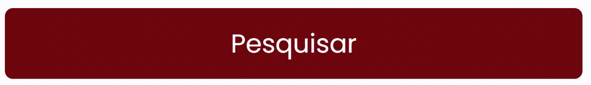

# Component Button

|Propriedade  | Tipo                        | Opcional  | Descrição |
|-------------|------------                 |---------- |---------- |
|textButton  |string                       | _false_     | texto do botão          |
|colorText   |string                       | _false_     | cor do texto do botão |
|bgColor      |string                       | _false_     | cor de background do botão |
|type         |'button', 'submit', 'reset'  | _true_      | tipo do botão a ser criado |
|onClick      |function                     | _false_     | função a ser executada ao clicar no botão |

---

## Exemplo de implementação do Button

Importe em seu arquivo `.ts` ou `.tsx`
```typescript
import { Button } from '../../src/components/Button';
```

Adicione o componente no retorno a ser renderizado
```html
<Button
  textButton={'Button test'}
  colorText={'#FFFFFF'}
  bgColor={'#700611'}
  onClick={() => { }}
  type={'button'}
/>
```


## Exemplo do botão
